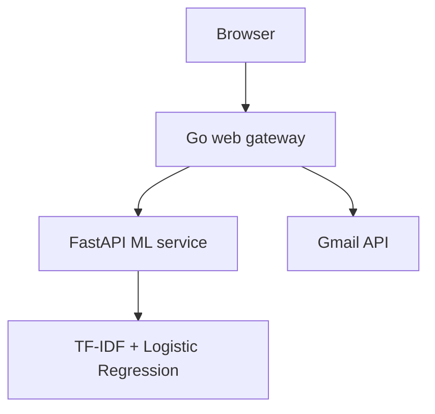

# Email Spam Detection

A BCA minor project that classifies email as **Spam** or **Not Spam**. It combines:

- a Go web server and HTML interface;
- a FastAPI prediction service;
- a saved TF-IDF + Logistic Regression pipeline; and
- optional Gmail read-only access through Google OAuth 2.0.

The application supports both manual subject/body input and classification of the five most recent Gmail inbox messages.

## Architecture



For Render, Go and FastAPI run inside one Docker container. Only the Go server is public. FastAPI listens on `127.0.0.1:8000` inside the container.

## Current features

- Manual email classification using subject and body
- Gmail OAuth 2.0 connection
- Read-only retrieval of the five most recent inbox messages
- Prediction through the saved scikit-learn pipeline
- Integrated Go-to-FastAPI request flow
- Combined health check for the Go and Python services
- Docker and Render Blueprint deployment configuration
- Four FastAPI tests

The application does not move, delete, or modify Gmail messages. OAuth tokens and downloaded emails are not written to disk.

## Model evaluation

Results recorded from the dataset test split:

| Model | Accuracy |
| --- | ---: |
| Multinomial Naive Bayes | 97.00% |
| Logistic Regression | 98.38% |

Real-world performance can differ from the held-out dataset result.

## Repository structure

```text
.
├── cmd/server/main.go                    # Go web server and routes
├── internal/gmailclient/gmailclient.go  # Gmail OAuth and message retrieval
├── internal/mlclient/                    # Go client for FastAPI
├── templates/index.html                  # Browser interface
├── Spam_detection/
│   ├── source/API.py                     # FastAPI application
│   ├── artifact/spam_detection_pipline.joblib
│   ├── tests/test_api.py
│   ├── Notebooks/                        # EDA and model training
│   ├── requirement.txt                   # Full notebook/development snapshot
│   └── requirements-render.txt           # Minimal deployment dependencies
├── scripts/start-render.sh               # Starts Python and Go in one container
├── Dockerfile
├── render.yaml
└── .env.example
```

The artifact filename intentionally retains the existing spelling `pipline` because the API currently loads that exact path.

## API contract

### `GET /health`

The public Go health route checks the internal FastAPI health route.

```json
{"status":"ok"}
```

### `POST /predict`

FastAPI accepts:

```json
{
  "subject": "Project meeting",
  "body": "Please bring your notebook tomorrow."
}
```

It returns:

```json
{
  "label": 0,
  "prediction": "not-spam"
}
```

`0` means Not Spam and `1` means Spam. Subject and body must both be strings. Either field may be empty, but they cannot both be blank.

The Go browser interface sends manual requests to `POST /api/check`, which forwards them to FastAPI's `POST /predict` route.

## Required versions

- Python 3.14.4
- Go 1.25.7

The Render Dockerfile pins these versions and pins scikit-learn to the version used to save the model.

## Environment variables

| Variable | Required | Purpose |
| --- | --- | --- |
| `GOOGLE_CLIENT_ID` | For Gmail | Google OAuth Web application client ID |
| `GOOGLE_CLIENT_SECRET` | For Gmail | Google OAuth client secret |
| `GOOGLE_REDIRECT_URL` | Locally | Exact OAuth callback URL |
| `RENDER_EXTERNAL_HOSTNAME` | Automatic on Render | Used to derive the hosted callback URL |
| `ML_API_URL` | No | Defaults to `http://127.0.0.1:8000` |
| `PORT` | No | Defaults locally to `8080`; Render supplies it automatically |

Never commit real OAuth credentials or a populated `.env` file.

## Google OAuth configuration

1. Open Google Cloud Console and select the project used for this application.
2. Ensure the Gmail API is enabled.
3. Configure the Google Auth Platform branding, audience, and data-access pages.
4. Create an OAuth client with application type **Web application**.
5. Add the local authorized redirect URI:

   ```text
   http://127.0.0.1:8080/auth/google/callback
   ```

6. After the first Render deployment, add the hosted redirect URI:

   ```text
   https://YOUR-RENDER-HOSTNAME/auth/google/callback
   ```

   The value must match exactly, including `https`, hostname, path, and trailing-slash behavior.

7. If the OAuth app is in Testing, add every Gmail account that will demonstrate the Gmail feature as a test user.

The app requests `gmail.readonly`, which lets it read message content and settings. For a classroom demonstration, use a dedicated test Gmail account containing sample messages instead of a personal inbox.

If the previous OAuth client secret was committed to Git, create a replacement credential before making the repository public. Removing a secret from the latest file does not remove it from Git history.

## Run locally

Run all commands from the repository root.

### 1. Create the Python environment

Linux/macOS:

```bash
python3.14 -m venv .venv
source .venv/bin/activate
python -m pip install -r Spam_detection/requirements-render.txt
```

Windows PowerShell:

```powershell
py -3.14 -m venv .venv
.\.venv\Scripts\python.exe -m pip install -r Spam_detection\requirements-render.txt
```

Install the full `Spam_detection/requirement.txt` snapshot only when working with the notebooks and visualization environment.

### 2. Set local OAuth variables

Create an ignored `.env` from `.env.example`, replace the placeholder values, and export it:

```bash
cp .env.example .env
set -a
source .env
set +a
```

PowerShell alternative:

```powershell
$env:GOOGLE_CLIENT_ID = "your-client-id"
$env:GOOGLE_CLIENT_SECRET = "your-client-secret"
$env:GOOGLE_REDIRECT_URL = "http://127.0.0.1:8080/auth/google/callback"
```

### 3. Start FastAPI

In terminal 1:

```bash
python -m uvicorn source.API:api \
  --app-dir Spam_detection \
  --host 127.0.0.1 \
  --port 8000 \
  --reload
```

FastAPI documentation: <http://127.0.0.1:8000/docs>

### 4. Start the Go web server

In terminal 2, export the same OAuth variables and run:

```bash
go run ./cmd/server
```

Open <http://127.0.0.1:8080>.

## Run the API tests

Install the two test-only packages and run pytest:

```bash
python -m pip install pytest==9.1.1 httpx==0.28.1
PYTHONPATH=Spam_detection python -m pytest Spam_detection/tests/test_api.py -v
```

The tests cover the health response, valid prediction, blank-input rejection, and missing-field validation.

## Deploy to Render

This repository uses one Docker-based Render web service so both languages wake and run together.

### Recommended: Render Blueprint

1. Push the deployment-ready files to GitHub.
2. In Render, select **New > Blueprint**.
3. Connect this GitHub repository and select `render.yaml`.
4. Enter `GOOGLE_CLIENT_ID` and `GOOGLE_CLIENT_SECRET` when Render requests the secret environment values.
5. Apply the Blueprint and wait for the Docker build to finish.
6. Open the generated `onrender.com` URL.
7. Copy its hostname and add this exact authorized redirect URI to the Google OAuth Web client:

   ```text
   https://YOUR-RENDER-HOSTNAME/auth/google/callback
   ```

8. Test these routes in order:

   - `/health`
   - `/`
   - manual classification
   - Gmail OAuth using an allowed test account

`render.yaml` selects the free plan and Singapore region. Render automatically redeploys when a new commit reaches the linked branch.

### Manual Render setup

If you create a Web Service instead of using the Blueprint, use:

| Setting | Value |
| --- | --- |
| Service type | Web Service |
| Language | Docker |
| Region | Singapore |
| Branch | The tested deployment branch |
| Root directory | Leave blank |
| Dockerfile path | `./Dockerfile` |
| Docker build context | `.` |
| Health check path | `/health` |
| Instance type | Free |

Add `GOOGLE_CLIENT_ID` and `GOOGLE_CLIENT_SECRET` under Environment. Do not put OAuth credentials in the Dockerfile or repository.

## Free-plan presentation note

Render's free web service can sleep after a period without traffic. Open the application a few minutes before presenting so the Go server, FastAPI service, and ML model are already warm.

## Troubleshooting

### `redirect_uri_mismatch`

The callback generated by the application is not an exact authorized redirect URI in Google Cloud. Compare the entire hosted URL.

### `Gmail OAuth is not configured`

One or both Google credential environment variables are missing from Render.

### `Access blocked` or test-user error

Add the Gmail account under the OAuth application's test users. Gmail read-only access is a restricted scope.

### `ML engine unavailable`

Open `/health` and inspect the Render logs. Confirm that the saved joblib artifact exists and that the pinned Python dependencies installed successfully.

### Render reports no open port

Confirm that the service uses the repository Dockerfile and that the Go process reads the `PORT` environment variable.

## Privacy and security

- Use a dedicated demo Gmail inbox.
- Never paste an OAuth client secret into source code, screenshots, issues, or documentation.
- Never commit `.env`, Gmail tokens, downloaded messages, or private datasets.
- The OAuth state value is generated randomly for each login and verified using a short-lived HTTP-only cookie.
- The current code processes Gmail data in memory and does not persist it.
